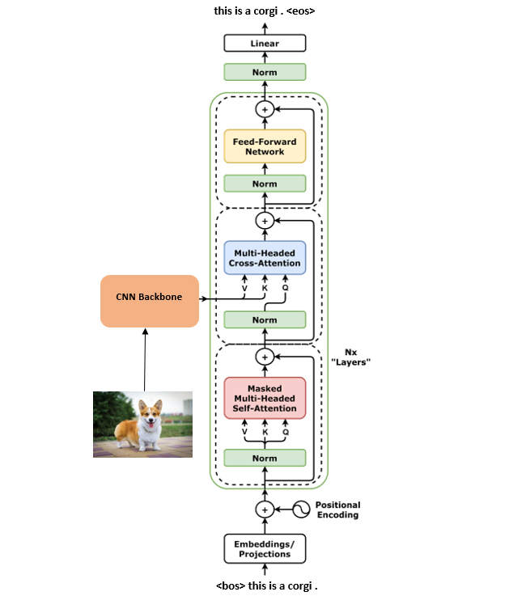

# Image Captioning model 

## Intro
This repo contains training and inference code for image captioning model (image2text).

An **image captioning model** is an artificial intelligence system designed to automatically generate textual descriptions for images. It integrates elements of computer vision to interpret visual content and natural language processing to formulate coherent sentences. The model typically processes the image through a convolutional neural network to extract visual features, and then uses a recurrent neural network or a transformer-based architecture to generate relevant captions based on those features. This technology is useful in various applications such as aiding visually impaired users, organizing image databases, and enhancing user interactions with multimedia content.
#### Examples

#### Application GUI

## Data
In this project, we used publicly available dataset **FlickR30K**.

The **Flickr30k** dataset is a popular benchmark for sentence-based picture portrayal. The dataset is comprised of **31,783** images that capture people engaged in everyday activities and events. Each image has a descriptive caption. Flickr30k is used for understanding the visual media (image) that correspond to a linguistic expression (description of the image). This dataset is commonly used as a standard benchmark for sentence-based image descriptions. 
The size is about **9GB**

Source - https://www.kaggle.com/datasets/hsankesara/flickr-image-dataset

## Model Architecture
#### Architecture diagram
The architecture of our Image captioning model consists of 3 parts:
  1) CNN as feature extractor from images. (EfficientNetB1 in our case)
  2) Transformer Encoder Block that process image embedding
  3) Transformer Decoder Block that generates a caption in autoregressive mode (token by token)

This architecture uses Convolution NN as a feature extractor that produces 2D "embedding" of image. Then, this "embedding" matrix produced by CNN is passed to Transformer Encoder block and then the model starts to generate caption in Transformer Decoder part. The last layer of our model is **softmax** over all words in **vocabulary**.

