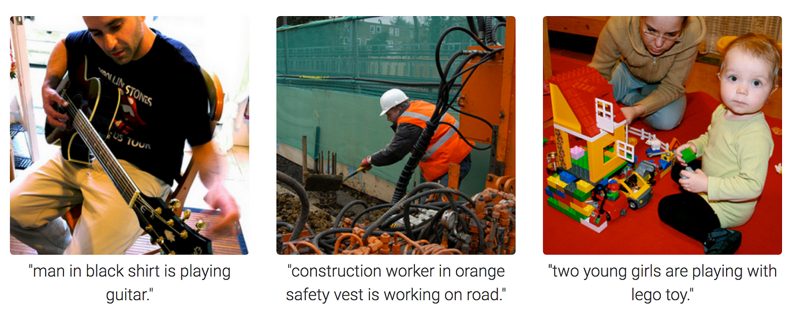
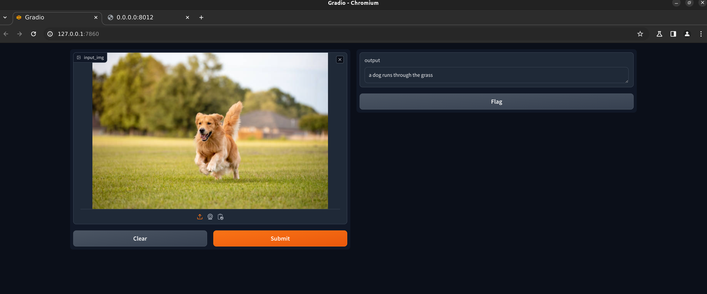

# Image Captioning model 

## Intro
This repo contains training and inference code for image captioning model (image2text).

An **image captioning model** is an artificial intelligence system designed to automatically generate textual descriptions for images. It integrates elements of computer vision to interpret visual content and natural language processing to formulate coherent sentences. The model typically processes the image through a convolutional neural network to extract visual features, and then uses a recurrent neural network or a transformer-based architecture to generate relevant captions based on those features. This technology is useful in various applications such as aiding visually impaired users, organizing image databases, and enhancing user interactions with multimedia content.
#### Examples

#### Application GUI

